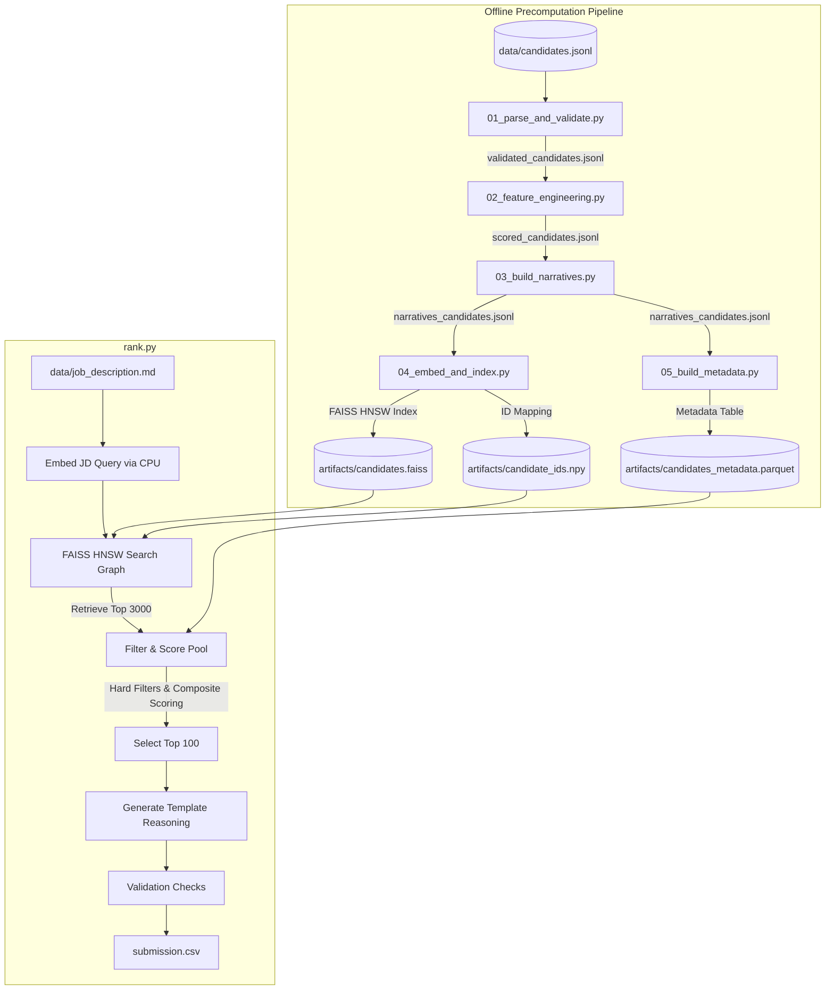

# Redrob Hackathon — Candidate Ranking & Retrieval System

An intelligent, two-stage recruitment screening system designed to retrieve, rank, and generate factual justification summaries for the top 100 candidates matching a specific Job Description (JD).

The pipeline runs semantic search via a local HuggingFace embedding model (`BAAI/bge-base-en-v1.5`) over an HNSW search graph, filters out honeypot and unqualified profiles, scores candidates on composite factors (semantic relevance, career history, availability), and outputs a formatted submission ranking.

🔗 **Live Demo:** [smart-candidate-discovery.streamlit.app](https://smart-candidate-discovery.streamlit.app/)

---

## 🏗️ Architecture & Pipeline Stages

The project is structured into two main phases:

1. **Offline Precomputation** *(not time-constrained)* — prepares the search index and flattens all profile-derived signals.
2. **Online Candidate Ranking** (`rank.py`) — runs inside the evaluation sandbox to retrieve, filter, score, and rank candidates under strict compute constraints.



---

## 📂 Module & File Breakdown

### Root Files

| File | Purpose |
|---|---|
| [`rank.py`](rank.py) | Main entry point for evaluation. Embeds the job description, queries the FAISS index for the top 3,000 matches, filters out invalid/honeypot/disqualified profiles, scores the remaining pool, generates rank-consistent reasoning, validates constraints, and writes the final 100 rows to `submission.csv`. |
| [`requirements.txt`](requirements.txt) | Exact pinned dependencies (PyTorch, FAISS-CPU, Sentence-Transformers, Pandas, etc.). |

### Precomputation Module (`precompute/`)

| File | Purpose |
|---|---|
| [`01_parse_and_validate.py`](precompute/01_parse_and_validate.py) | Validates candidate structure, detects honeypot profiles (impossible start dates, negative active times, salary mismatches), outputs a validated JSONL dataset. |
| [`02_feature_engineering.py`](precompute/02_feature_engineering.py) | Pre-calculates `career_score` (JD/skill match) and `behavioral_score` (login recency, notice period, responsiveness); flags disqualifications (consulting background, lack of tech experience, junior status, high salary expectations). |
| [`03_build_narratives.py`](precompute/03_build_narratives.py) | Aggregates structured profile fields into a natural-language "narrative" block per candidate (kept under the model's 512-token limit) for better embedding quality. |
| [`04_embed_and_index.py`](precompute/04_embed_and_index.py) | Loads `BAAI/bge-base-en-v1.5`, generates normalized embeddings from narratives, builds a FAISS HNSW flat index for fast search. |
| [`05_build_metadata.py`](precompute/05_build_metadata.py) | Flattens all precomputed career/behavioral metrics and signals into a unified Parquet metadata table. |

### Demo / Sandbox Module (`sandbox/`)

| File | Purpose |
|---|---|
| [`sandbox/app.py`](sandbox/app.py) | Interactive Streamlit interface for recruiters to test job descriptions against sample candidate pools, visualizing match scores and generated reasoning. Live deployment: [smart-candidate-discovery.streamlit.app](https://smart-candidate-discovery.streamlit.app/). |

---

## ⚙️ Installation & Setup

### Prerequisites

- **Python:** `3.9`–`3.11` (required for compatibility with `faiss-cpu==1.8.0` and `torch==2.2.2`)
- **OS:** Windows, macOS, or Linux

### Setup Steps

**1. Clone & navigate to the repository**
```bash
git clone https://github.com/Gauravsharma2711/redrob-hackathon.git
cd redrob-hackathon
```

**2. Create and activate a virtual environment**

Windows (PowerShell):
```powershell
python -m venv venv
.\venv\Scripts\Activate.ps1
```

Linux / macOS:
```bash
python3 -m venv venv
source venv/bin/activate
```

**3. Install dependencies**
```bash
pip install -r requirements.txt
```

**4. Verify data files are in place**

Ensure the following exist under `data/`:
- `data/candidates.jsonl` — full candidate dataset
- `data/sample_candidates.json` — test/sample dataset
- `data/job_description.md` — job description

---

## 🏃 Running & Usage

Two ways to run, depending on whether you're sanity-checking the pipeline or producing the real submission.

### 1. Test Mode — quick sandbox verification

Runs the full pipeline on a lightweight 50-candidate sample. Useful for verifying code logic without heavy computation.

```bash
# 1.1 — Parse structure and detect honeypots on the sample
python precompute/01_parse_and_validate.py --mode test

# 1.2 — Compute career and behavioral signals for the sample
python precompute/02_feature_engineering.py --mode test

# 1.3 — Assemble sample candidate text narratives
python precompute/03_build_narratives.py --mode test

# 1.4 — Encode narratives and build the sample FAISS HNSW index
python precompute/04_embed_and_index.py --mode test

# 1.5 — Build the sample Parquet metadata table
python precompute/05_build_metadata.py --mode test

# 1.6 — Run the ranker and generate/validate the final CSV
python rank.py --mode test
```

### 2. Full Mode — all 100,000 candidates

Processes the complete dataset. Generating the full embedding index (step 2.4) takes roughly **~10 minutes on a GPU** (e.g. Kaggle T4) or **~40 minutes on an 8-core CPU**.

```bash
# 2.1 — Parse and validate all 100K profiles
python precompute/01_parse_and_validate.py --mode full

# 2.2 — Run complete feature engineering & disqualifiers
python precompute/02_feature_engineering.py --mode full

# 2.3 — Build narratives for all profiles
python precompute/03_build_narratives.py --mode full

# 2.4 — Generate embeddings & build the main FAISS search graph
#       (tip: use a GPU-enabled environment for this step if possible)
python precompute/04_embed_and_index.py --mode full

# 2.5 — Compile the unified candidate metadata Parquet file
python precompute/05_build_metadata.py --mode full

# 2.6 — Run the online ranker to retrieve, score, write, and validate the submission
python rank.py --mode full
```

> **Note:** The final validator runs automatically inside `rank.py` (Stage 6), checking row count, monotonicity, rank order, and score range boundaries.

---

## ⚖️ Compliance

`rank.py` is explicitly built to satisfy the evaluation sandbox's compute constraints:

| Constraint | Status | Verification |
|---|---|---|
| **CPU-only** | ✅ Compliant | `SentenceTransformer(MODEL_NAME, device="cpu")` is loaded explicitly on `"cpu"`. |
| **≤ 5 min wall-clock** | ✅ Compliant | FAISS HNSW search retrieves the top 3,000 candidates in ~100ms; filtering, scoring, and writing the CSV takes under 3 seconds total. |
| **≤ 16 GB RAM** | ✅ Compliant | Index and metadata are compressed; peak memory footprint is ~1.2 GB (FAISS index + loaded Parquet + model weights). |
| **No hosted LLM APIs** | ✅ Compliant | All reasoning is generated by a rule-based template script using factual candidate details — no external API calls. |
| **No network calls** | ✅ Compliant | No active requests are sent during ranking. **Note:** `BAAI/bge-base-en-v1.5` weights must be pre-downloaded into the local HuggingFace cache (`~/.cache/huggingface/hub/`) before running. |